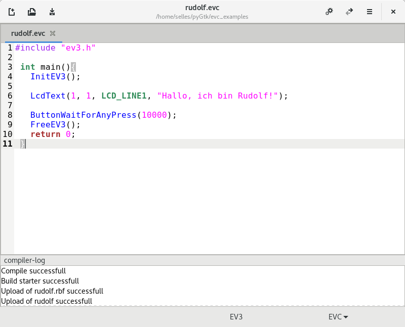

# Programmierung LEGO:registered: EV3 Roboter mit EVC

+ <a href="#vor">Vorwort</a>
+ <a href="#first">Das erste selbstgeschriebene Programm</a>
    + Baue einen Roboter
    + MindEd
    + <a href="#rudolf">Rudolf stellt sich vor</a>
    + <a href="#always">Grundgerüst</a>
+ <a href="#fahre">Rudolf fährt um den Block</a>
+ <a href = "#variables">Variablen</a>
+ Kontrollstrukturen
+ <a href="#sensors">Sensoren</a>
    + <a href="#touch">Berührungssensor</a>
    + <a href="#light">Farbsensor</a>
    + <a href="#gyro">Kreiselsensor</a>
    + <a href="#ultrasonic">Ultraschallsensor</a>
    + Infrarotsensor
    + NXT-Soundsensor
+ Tasks und Subroutinen
+ <a href = "#music">Musik</a>
+ Mehr über Motoren
+ <a href = "#moresensors">Mehr über Sensoren</a>
+ <a href = "#parallel">Parallele Tasks</a>
+ <a href = "#more">Weitere Befehle</a>
    + <a href="#lcd">LCD-Ausgabe</a>
    + LEDs

<h2 id="vor">Vorwort</h2>

Viele Leute finden eine grafische Programmierung prima, aber manche bevorzugen
doch die textbasierte Programmierung. Hierzu entwickelte John Hansen für den
Mindstorms NXT Stein die an C angelehnte Programmiersprache NXC. In Kombination
mit dem Bricx Command Center ([BricxCC](http://bricxcc.sourceforge.net/)) war es
nun einfach, Programme zu schreiben, auf den NXT zu übertragen und zu starten.
Als dann der Mindstorms EV3 Stein erschien, hatte wieder John Hansen begonnen,
eine C-ähnliche Programmiersprache zu entwickeln. Diese Ansätze wurden an der
Hochschule Aschaffenburg im Rahmen des [EVELIN](http://www.evelinprojekt.de/en/)
Projektes weiterentwickelt und sind auf Github zu finden.


Für Linux-Nutzer steht mit MindEd eine Programmierumgebung zur Verfügung, die

+ mit der originalen Firmware arbeitet,
+ NXT-Steine mit NXC und
+ EV3-Steine mit EVC unterstützt.
+ Mit Syntax-Hervorhebung und
+ Auto-Vervollständigung und
+ API-Details das Programmieren erleichtert.
+ Die Programme auf Knopfdruck kompiliert
+ und per USB-Kabel überträgt.

Dieses Tutorial will dich bei den ersten Schritten mit EVC begleiten -- es ist
gar nicht so schwer.

### Danksagung

Ich habe mich auf die Arbeiten vieler Vordenker gestützt: John Hansen's
[NXC und NBC](http://bricxcc.sourceforge.net/) und
[nxt-python](https://github.com/Eelviny/nxt-python) ermöglichten eine erste
Version von MindEd, dann kam über [c4ev3](http://github.com/c4ev3) und 
Christoph Gaukel's [ev3-python3](https://github.com/ChristophGaukel/ev3-python3)
mit seinem [EV3 Direct Commands-Blog](http://ev3directcommands.blogspot.com/)
die Erweiterung für den EV3, aber ebenso wichtig: Daniele Benedettelli mit seinem
[NXC-Tutorial](http://roberta-home.de/sites/default/files/Roberta_Band_NXT_Programmierung_FINAL.pdf),
welches mich und viele meiner Schüler in die Programmierung von LEGO Mindstorms
Robotern mit einer an C angelehnten Sprache einführte.

<h2 id="first"> Das erste selbstgeschriebene Programm</h2>

### Baue einen Roboter

Für die folgenden Übungen solltest du dir einen fahrenden Roboter mit zwei Motoren
bauen, einen für das linke Rad an Ausgang B, einen für das rechte Rad an Ausgang C.
Beispiele kannst du [hier](http://robotsquare.com/wp-content/uploads/2013/10/45544_educator.pdf)
oder [hier](http://robotsquare.com/2015/10/06/explor3r-building-instructions/) finden.

### MindEd

Starte MindEd. Es sieht aus wie ein ganz normaler Text-Editor. Links oben in der
Kopfleiste finden sich die üblichen Buttons für Datei neu, Datei öffnen und Datei
speichern. Auf der rechten Seite finden sich die Buttons zum Kompilieren, Übertragen
und weitere Optionen. In der Fußleiste ist EV3 zu lesen, wenn ein EV3-Stein
angeschlossen ist - oder eben NXT, wenn ein solcher Stein über USB verbunden ist.
Ist eine Datei mit der Endung `.evc` geladen, dann steht rechts unten auch EVC als
ausgewählte Sprache. Oder eben NXT, wenn eine `.nxc`-Datei geladen ist.

Bei einer neuen Datei weiß MindEd natürlich nicht, ob sie für einen NXT- oder 
einen EV3-Stein bestimmt sein soll, mit einem Klick kann hier die passende Sprache
ausgewählt werden. Damit wird dann auch die Syntax-Hervorhebung und die Auto-
Vervollständigung aktiviert.



<h3 id="rudolf">Rudolf stellt sich vor</h3>

Tippe das folgende Programm in MindEd ein und speichere es als `rudolf.evc`:

```c
#include "ev3.h"
int main(){
  InitEV3();
  
  LcdText(1, 1, LCD_LINE1, "Hallo, ich bin Rudolf!");ButtonWaitForAnyPress(10000);
  
  FreeEV3();
  return 0;
}
```

Hast du gemerkt, dass bei den EVC-Befehlen nach dem zweiten Buchstaben die
Auto-Vervollständigung anspringt und dir Vorschläge macht? Mit Pfeil runter oder
hoch wählst du denn gewünschten Befehl aus, mit einem Klick auf Details kannst du
zum gewählten Befehl noch näheres erfahren. Mit Eingabe-Taste :leftwards_arrow_with_hook:
wird er übernommen. Die Blaufärbung gibt dir die Gewissheit, das dieser Befehl
bekannt und richtig geschrieben ist.

:warning: *Jeder Befehl endet mit einem Strich-Punkt. Zu jeder öffnenden Klammer
gehört eine schließende.*

Nun schalte den EV3-Stein ein, schließe ihn mit dem USB-Kabel an den Computer an
und übertrage das Programm mit einem Klick auf den Transmit-Button zum EV3-Stein.
Wenn alles geklappt hat, sollte im unteren Teil des MindEd-Fensters `Upload of
rudolf successfull` zu lesen und ein Sound zu hören sein.  
In der Datei-Navigation des EV3-Steins findest du jetzt den Ordner `rudolf`, öffne
ihn und führe darin das Programm `rudolf` aus. Wenn jetzt auf dem EV3-Display zu
sehen ist: `Hallo, ich bin Rudolf!` - Glückwunsch, du hast es geschafft - dein
erstes C-Programm für den EV3!

<h3 id="always">Grundgerüst</h3>

```c
#include "ev3.h"

int main(){
  InitEV3();

  // hier kommt der Programmcode hin

  FreeEV3();
  return 0;
}
```

<h2 id="fahre">Rudolf fährt um den Block</h2>

Rudolf soll sich bewegen. Dazu nehmen wir den schon von NXC bekannten Befehl 
`OnFwd(outputs, pwr)`.

```c
#include "ev3.h"

int main(){
  InitEV3();

  OnFwd(OUT_BC, 75);
  Wait(1000);
  OnRev(OUT_BC, 75);
  Wait(1000);
  
  FreeEV3();
  return 0;
}
```

`OnFwd(OUT_BC, 75);` übersetzt: einschalten, vorwärts, Ausgänge B und C mit 75%
Leistung. Damit schaltest du die Motoren an. `Wait(1000);` lässt Rudolf mit der
Ausführung des nächsten Befehls 1 Sekunde warten, also fährt Rudolf 1 Sekunde lang
vorwärts. Jetzt kommt `OnRev(OUT_BC, 75);` , du ahnst es: einschalten, rückwärts,
... also fährt Rudolf rückwärts. Und wartet nochmal 1 Sekunde, dann ist das
Programm am Ende angelangt und Rudolf rollt aus.

In EVC geht das jetzt kürzer mit `OnFor(outputs, time, power)`.

```c
#include "ev3.h"

int main(){
  InitEV3();

  OnFor(OUT_BC, 1000, 75);
  OnFor(OUT_BC, 1000, -75);

  FreeEV3();return 0;
}
```

Der Befehl bekommt gleich mitgeteilt, wie lange er gelten soll. Und die Richtung
wird über das Vorzeichen der Leistung festgelegt: positiv vorwärts, negativ rückwärts.
Leider hüpft Rudolf beim Richtungswechsel, weswegen er nicht wieder an seiner
Startposition ankommt. Das Problem: von voll vorwärts auf voll rückwärts in null
komma nichts. Die Lösung: erst abbremsen und dann wieder beschleunigen. Dazu
gibt es den Befehl `OutputTimePower(outputs, power, time1, time2, time3)`. Dann
kommt mit `time1` die Beschleunigungszeit, mit `time2` die Zeit mit der angegebenen
Geschwindigkeit und mit `time3` schließlich die Bremszeit.

Das verleitet zu diesem Programm:

```c
#include "ev3.h"

int main(){
  InitEV3();

  OutputTimePower(OUT_BC, 75, 250, 500, 250);
  OutputTimePower(OUT_BC, -75, 250, 500, 250);

  FreeEV3();
}
```

Doch was passiert? Gar nichts! Rudolf bleibt stehen! Warum?
Weil die Output-Befehle nicht den EV3-Stein blockieren, bis die angegebene Zeit
vorbei ist. Denn der EV3 kann in dieser Zeit weitere Aufgaben erledigen. In
diesem Programm hat Rudolf nichts weiter zu tun, er ist gleich wieder am Ende.
Sollen wir ihm zwei `Wait(1000);` verpassen? Das ginge, aber damit ist der EV3
wieder blockiert, sicher nicht im Sinne des Entwicklers. Der hat für diesen Zweck
`MotorBusy(output)` vorgesehen. Dieser Befehl ist eher als Frage aufzufassen,
denn er unterscheidet sich von den bisherigen in einer ganz wichtigen Eigenschaft:
er antwortet! Frage: Motor, bist du beschäftigt? Antwort Motor: ja = 1, nein = 0.
Das in eine while-Schleife packen:

```c
#include "ev3.h"

int main(){
  InitEV3();

  OutputTimePower(OUT_BC, 75, 250, 500, 250);
  while(MotorBusy(OUT_B));
  OutputTimePower(OUT_BC, -75, 250, 500, 250);
  while(MotorBusy(OUT_B)){
    PlayTone(880, 200);
    Wait(300);
  }

  FreeEV3();
  return 0;
}
```

Rudolf fährt wieder und beim Rückwärtsfahren piept er wie ein großer Lastwagen.
Allerdings wird Rudolf langsamer werden, wenn er bergauf fahren soll. Und er
wird deutlich schneller werden, wenn es den Berg herunter geht. Es wäre besser,
wenn er seine Power der Steigung anpasst und so mit gleichbleibender Geschwindigkeit
fährt. Glücklicherweise sind die EV3-Motoren reguliert, was bedeutet, die können
die Kraft für eine geforderte Geschwindigkeit anpassen. Der Befehl dazu unterscheidet
sich kaum vom vorherigen: `OutputTimeSpeed(outputs, speed, time1, time2, time3)`.
Ändere das vorige Programm ab, ersetze dort Power durch Speed und lasse Rudolf
eine schräge Ebene hoch und runter fahren.

```c
...
  OutputTimeSpeed(OUT_BC, 75, 250, 500, 250);
  while(MotorBusy(OUT_B));
  OutputTimeSpeed(OUT_BC, -75, 250, 500, 250);
  while(MotorBusy(OUT_B));
...
```

Mit Speed anstelle von Power zu arbeiten ist häufig die bessere Variante.

### Rudolf fährt ums Quadrat

Rudolf fährt also geradeaus, biegt nach links ab, fährt geradeaus, nach links
usw. Wie biegt er nach links ab? Indem das linke Rad sich langsamer dreht als
das rechte, oder gar nicht oder sogar rückwärts. Erstmal soll das linke Rad
stehen bleiben. Ein mögliches - aber ganz schlechtes - Programm:

```c
...
  OnFor(OUT_BC, 1000, 50);    // beide Motoren an -> geradeaus
  OnFor(OUT_C, 250, 50);      // nur rechter Motor an -> links Kurve
  OnFor(OUT_BC, 1000, 50);
  OnFor(OUT_C, 250, 50);
  OnFor(OUT_BC, 1000, 50);
  OnFor(OUT_C, 250, 50);
  OnFor(OUT_BC, 1000, 50);
  OnFor(OUT_C, 250, 50);
...
```

Hast du es ausprobiert? Dann hast du sicher gemerkt, warum es so nichts taugt.
Garantiert stimmt die Zeit nicht für eine 90° Kurve, du musst ewig ausprobieren
und jedesmal an vier Stellen die Zeiten ändern. Zwischenzeitlich sinkt die
Spannung der Batterien und wieder stimmt die Zeit nicht. Wäre es mit `OutputTimeSpeed`
besser? Nein, eher noch schlimmer. Was tun? Damit Rudolf einmal um das Quadrat
fährt, muss er viermal das gleiche machen, aber nicht du, denn dafür gibt es
Schleifen. Hier bietet sich eine Zählschleife an:

```
for(Initialisierung; Test, Fortsetzung){
  Anweisungen;
}
```

Beispiel

Initialisierung des Zählers

```c
...
  int i;
  for(i=0;i<9;i++){
    LcdPrintf(1,"Zahl: %d\n", i);
    Wait(500);
  }
  ButtonWaitForAnyPress(10000);
...
```

```c
...
  int i;
  for(i = 0; i<4; i++){
    OnFor(OUT_BC, 1000, 50);    // beide Motoren an -> geradeaus
    OnFor(OUT_C, 600, 50);      // nur rechter Motor an -> links Kurve
  }
...
```

<h2 id = "variables">Variablen</h2>

Eine Variable kann man sich als eine Kiste vorstellen, in die man etwas hinein
legt, um es bei Bedarf wieder heraus zu holen. Wenn man viele solcher Kisten hat,
ist es erstens sinnvoll, sie zu beschriften und zweitens, sie möglichst klein zu
halten, weil sonst das Regal zu klein wird, in dem diese Kisten gelagert werden.
Für den Computer gibt es ein weiteres Problem: er kennt nur Nullen und Einsen.
Egal ob Buchstaben oder Zahlen, alles wird im binären Zahlensystem verarbeitet.
Wenn der Computer dann in der Kiste nachschaut, findet er beispielsweise diese
Kombination: 01000001. Das könnte die Zahl 65 oder der Buchstabe A sein. Wieso?
Googel mal nach Binärsystem und ASCII-Tabelle. Man muss also drittens auf der
Kiste vermerken, was drin ist. Damit sind wir bei den Datentypen.

### Datentypen

Bevor man Variablen verwendet, sollte man sich überlegen, was man darin speichern oder verarbeiten möchte:

+ Zeichen
+ Text
+ Zahl
+ Kommazahl

Denn entsprechend ist der richtige Datentyp zu wählen.

```c
#include "ev3.h"
int main(){
InitEV3();
LcdTextf(1,1,LCD_LINE1,"short:      %2d Bit", sizeof(short)\*8);
LcdTextf(1,1,LCD_LINE2,"int:        %2d Bit", sizeof(int)\*8);
LcdTextf(1,1,LCD_LINE3,"long:       %2d Bit", sizeof(long)\*8);
LcdTextf(1,1,LCD_LINE4,"long long:  %2d Bit", sizeof(long long)\*8);

LcdText(1,1,LCD_LINE8,"Exit mit <CENTER>");
ButtonWaitForPress(BTNCENTER);
FreeEV3();
}
```

| Datentyp | Speichergröße | Wertebereich |
|----------|---------------|--------------|
|short |16 Bit |0 bis 65.535|
|int |32 Bit| 0 bis 4.294.967.295|
|long| 32 Bit ||
|long long |64 Bit|0 bis 18.446.744.073.709.551.615|
|float|||
|double|||
|long double|||

## Kontrollstrukturen

<h2 id="sensors">Sensoren</h2>

<h3 id="touch">Berührungssensor</h3>

```c
#include "ev3.h"

int main(){
  InitEV3();

  LcdText(1, 1, LCD_LINE1, "Tastsensor in Eingang 1");
  LcdText(1, 1, LCD_LINE2, "Motoren an Ausgang BC");
  LcdText(1, 1, LCD_LINE8, "Exit mit <CENTER>");
  
  SetSensorTouch(IN_1);              // Initialisierung des Sensors

  OnFwd(OUT_BC, 50);                 // Fahre vorwärts,

  while(ReadSensor(IN_1) == 0);      // solange Sensor nicht gedrückt.
  
  Off(OUT_BC);                       // Wenn gedrückt, halte an.

  FreeEV3();
  return 0;
}
```

<h3 id="light">Farbsensor</h>

Der EV3-Farbsensor kann zum einen reflektiertes Licht messen, dazu schaltet er die
rote Diode an und misst das reflektierte rote Licht. Das funktioniert am Besten
in einem Abstand zur Oberfläche von 5 - 10 mm. Dieser Modus wird oft gebraucht,
deshalb gibt es den Befehl `SetSensorLight(port)`.  
Der EV3-Farbsensor kann auch das Umgebungslicht messen, da scheint dann nur die
blaue Diode.  
Und dann kann der EV3-Farbsensor auch Farben erkennen, naheliegender Befehl:
`SetSensorColor(port)`.

#### Ein einfacher Linienfolger

Rudolf soll einer schwarzen Linie folgen, dazu bekommt er einen nach unten
gerichteten Farbsensor angebaut, den du mit `SetSensorLight(port)` im
Modus reflektiertes Licht auslesen kannst. Eigentlich folgt er nicht der
schwarzen Linie, sondern der Kante der Linie. Sieht der Sensor weiß, fährt
Rudolf auf linken Seite der Linienkante, sieht er schwarz, fährt er auf der
rechten Seite der Kante.  
Im Port View Menü schaust du nach, welche Werte der Lichtsensor liefert, wenn
er weiß und wenn er schwarz sieht. Daraus errechnet Rudolf dann den Grau-Wert,
bei dem er geradeaus fährt.

```c
#include "ev3.h"

int main(){
    InitEV3();
    
    int black = 10;
    int white = 90;
    int grey = (white + black)/2;	// 11 ... 50 ... 88: d38
    int reflected = 0;
    int targetspeed = 30;			// grey / targetspeed = kc
    float kp = 0.79;				// kc = 0.79
    int error = 0;
    int turn;
    int powerA;
    int powerB;
    
    SetSensorLight(IN_2);

    OutputPower(OUT_BC, targetspeed);
	OutputStart(OUT_BC);
	
    LcdText(1,0,LCD_LINE8,"Exit mit <CENTER>");
    
    while(ButtonIsUp(BTNCENTER)){
		reflected = ReadSensor(IN_2);
		error = reflected - grey;	// -38 ... 0 ... +38
		turn = kp * error;
		
		powerA = targetspeed + turn;
		if(powerA > targetspeed + grey) powerA = targetspeed + grey;
		if(powerA < 0) powerA = 0;
		
		powerB = targetspeed - turn;
		if(powerB > targetspeed + grey) powerB = targetspeed + grey;
		if(powerB < 0) powerB = 0;
		
		OutputPower(OUT_B, powerA);
		OutputPower(OUT_C, powerB);
    }

    OutputStop(OUT_BC,1);

    FreeEV3();
    return 0;
}
```

<h3 id="gyro">Kreiselsensor</h3>

:warning: Rudolf kalibriert den Kreiselsensor beim Booten, deshalb muss er dabei absolut ruhig stehen.

```c
#include "ev3.h"

int main(){
  InitEV3();

  SetSensorGyro(IN_4);         // Set gyrosensor in angle-mode

  int angle0, angle1, turn, port;

  // Keep sensor from shifting and set the angle to 0
  port = ResetGyro();

  LcdTextf(1, 1, LCD_LINE1, "Gyrosensor at port %d", port);

  angle0 = ReadSensor(IN_4);     // get actual angle

  LcdText(1, 1, LCD_LINE8, "Exit with <CENTER>");
  LcdSelectFont(2);
  LcdText(1, 1, LCD_LINE6, " TURN ME!");
  LcdSelectFont(1);
  
  while(ButtonIsUp(BTNCENTER)){
    angle1 = ReadSensor(IN_4);
    turn = angle1 - angle0;
    LcdTextf(1, 1, LCD_LINE3, "Initial value: %d   ", angle0);
    LcdTextf(1, 1, LCD_LINE4, "Actual value: %d    ", turn);
    Wait(50);
  }
FreeEV3();
return 0;
}
```

<h3 id="ultrasonic">Ultraschallsensor</h3>

```c
#include "ev3.h"

int main(){
  InitEV3();
  
  int x = 0;
  
  LcdText(1, 1, LCD_LINE1, "UltraschallSensor");
  LcdText(1, 1, LCD_LINE8, "Exit with <CENTER>");

  SetSensorUS(IN_3);
  
  while(ButtonIsUp(BTNCENTER)){

    x = ReadSensor(IN_3);       // distance in cm, 0 to 255

    LcdTextf(1, 1, LCD_LINE3, "Entfernung: %3d cm", x);
    Wait(20);
  }

  FreeEV3();
  return 0;
}
```

### Infrarotsensor

### NXT-Soundsensor

```c
#include "ev3.h"

int main(){
  InitEV3();
  
  int x;
  int min;
  int max;
  
  SetSensorNXTSound(IN_2);

  LcdSelectFont(1);
  LcdText(1,1,LCD_LINE8,"Exit with <CENTER>");
  LcdText(1,1,LCD_LINE6,"Reset with <DOWN>");
  
  while(ButtonIsUp(BTNCENTER)){
    
    x = ReadSensor(IN_2);
    
    if(x>max){
      max = x;
    }
    if(x<min){
      min=x;
    }
    
    LcdTextf(1,1,LCD_LINE3, "Sensor: %3d", x);
    LcdTextf(1,1,LCD_LINE4, "max:    %3d", max);
    LcdTextf(1,1,LCD_LINE5, "min:    %3d", min);
    Wait(20);
    if(ButtonIsDown(BTNDOWN)){
      min = 5000;
      max = 0;
    }
  }
  
  FreeEV3();
  return 0;
}
```

## Tasks und Subroutinen

<h2 id = "music">Musik</h2>

```c
#include "ev3.h"
int main(){
  InitEV3();

  LcdText(1,1,LCD_LINE1,"Play sounds");
  PlayTone(440,500);
  Wait(550);                           // necessary, no wait hardcoded

  PlayToneEx(440, 500, 30);
  Wait(550);

  PlaySound(SOUND_CLICK);
  Wait(300);                           // only for better separation

  PlaySound(SOUND_UP);
  Wait(300);                           // unnecessary, because
  PlaySound(SOUND_LOW_BEEP);
  Wait(300);                           // wait is hardcoded

  unsigned short melody[7][2] = {
    {TONE_D4, NOTE_QUARTER},             // 1000/4
    {TONE_E4, NOTE_EIGHT},
    {TONE_D4, NOTE_EIGHT},
    {TONE_F4, NOTE_EIGHT},
    {TONE_D4, NOTE_EIGHT},
    {TONE_E4, NOTE_EIGHT},
    {TONE_D4, 750}
  };

  PlayTones(melody);

  //PlayFile("/home/root/lms2012/sys/ui/GeneralAlarm.rsf");
  PlayFile("/home/root/lms2012/sys/ui/OverpowerAlert.rsf");
  
  LcdText(1,1,LCD_LINE8,"Exit with <CENTER>");
  ButtonWaitForAnyPress(10000);
  FreeEV3();
}
```

## Mehr über Motoren

<h2 id = "moresensors">Mehr über Sensoren</h2>

Neben den benannten Sensor-Initialisierungen gibt es weitere Modi, die mit
`SetSensorMode(port, mode)` ausgelesen werden können.

```c
...
  int x;
      SetSensorMode(IN_1, TOUCH_PRESS);
    
      while(ButtonIsUp(BTNCENTER)){
          x = ReadSensor(IN_1);
          NumOut(30,LCD_LINE3,x);
          Wait(20);
      }
...
```

| Sensor             | Modus       | Befehl            | Return |
|--------------------|-------------|-------------------|--------|
|EV3-Touch           | TOUCH       | SetSensorTouch    | Press |
|EV3-Light           | COL_REFLECT | SetSensorLight    | Reflect |
|                    | COL_AMBIENT |                   | Ambient |
|                    | COL_COLOR   | SetSensorColor    | Color |
|EV3-Ultrasonic      | US_DIST_CM  | SetSensorUS       | Dist in cm |
|                    | US_DIST_MM  |                   | Dist in mm |
|                    | US_DIST_IN  |                   | Dist in inch |
|EV3-Gyroskop        | GYRO_ANG    | SetSensorGyro     | angle |
|                    | GYRO_RATE   |                   | rate |
|EV3-Infrared        | IR_PROX     | SetSensorIR       | Proximity |
|                    | IR_SEEK     |                   | Seek |
|                    | IR_REMOTE   |                   | Remote Control |
|NXT-Temperature     | NXT_TEMP_C  |                   | Temperature in C |
|                    | NXT_TEMP_F  |                   | Temperature in F |
|NXT-Touch           | NXT_TOUCH   | SetSensorNXTTouch | |
|NXT-Light 9844      | NXT_REFLECT | SetSensorNXTLight | |
|                    | NXT_AMBIENT |                   | |
|NXT-Color 9694      | NXT_COL_REF | | |
|                    | NXT_COL_AMB | | |
|NXT-Sound           | NXT_SND_DB  | SetSensorNXTSound | Decibels |
|                    | NXT_SND_DBA |                   | A-Weighted Decibels |
|HiTechnic IR-Seeker | HT_DIR_DC   | | Direction of IR signal 1-9 |


<h2 id="parallel">Parallele Tasks</h2>

```c
#include <pthread.h>
#include "ev3.h"

bool blink = TRUE;

void *blinkFunc(void *arg){
  while(blink){
    OnFwd(OUT_D,50);
    Wait(200);
    Off(OUT_D);
    Wait(200);
  }
  return NULL;
}

int main(){
  InitEV3();

  pthread_t pth;

  SetSensorTouch(IN_1);
  short x;

  pthread_create(&pth,NULL,blinkFunc,"foo");

  LcdText(1,1,LCD_LINE8,"Exit with <CENTER>");

  while(ButtonIsUp(BTNCENTER)){
    x = ReadSensor(IN_1);
    LcdTextf(1,1,LCD_LINE3,"Taster: %d", x);

    if(x==1){blink=FALSE;}
    Wait(10);
  }

  FreeEV3();
  pthread_exit(NULL);
}
```

<h2 id = "more">Weitere Befehle</h2>

<h3 id="lcd">LCD-Ausgabe</h3>

Formatierte Ausgaben auf dem Display sind mit `LcdTextf(color, x, y, format string, variable)`
zu erreichen - so wie in C mit `printf`.  

```c
int huete = 1, ecken = 3;
LcdTextf(1, 1, LCD_LINE3, " %d Hut hat %d Ecken", huete, ecken); 

```

Printf format strings - kurz und unvollständig `%width.precision.specifier`
Benutze als specifier d für eine Ganzezahl, f für eine Kommazahl und s für eine Zeichenkette.
precision gibt die maximale Anzahl an Stellen für die Ausgabe an, width die minimale.

```
printf("Ich habe %d Vogel", 1 );     Ich habe 1 Vogel
printf("Ich habe %.3d Euro", 0; )    Ich habe 000 Euro
printf("%.3f", 1.2348 );             1.235
printf("Bier hat %.1f %% ", 4.9)     Bier hat 4.9 %
printf("%.5s", "abcdef")             abcde
printf("%6.2f", 123.45)              123.45
printf("%6.2f", 1.23)                  1.23
```

Weitere Beispiele finden sich z.B. [hier](http://www.cprogramming.com/tutorial/printf-format-strings.html).

### LEDs

```c
#include "ev3.h"

int main(){
  InitEV3();
  int i;
  
  const char *ledpatterns[] = {
    "LED_BLACK",
    "LED_GREEN",
    "LED_RED",
    "LED_ORANGE",
    "LED_GREEN_FLASH",
    "LED_RED_FLASH",
    "LED_ORANGE_FLASH",
    "LED_GREEN_PULSE",
    "LED_RED_PULSE",
    "LED_ORANGE_PULSE"
  };
  
  for(i=9;i>=0;i--){
    LcdClean();
    LcdText(1, 1, LCD_LINE4, ledpatterns[i]);
    SetLedPattern(i);
    Wait(2000);
  }
  LcdClean();
  LcdText(1, 1, LCD_LINE4, "WARNING");
  SetLedPattern(1);
  SetLedWarning(1);
  
  ButtonWaitForAnyPress(10000);
  
  FreeEV3();
}
```
